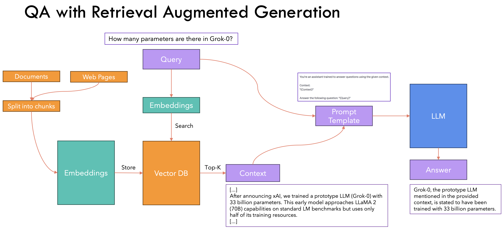

# 🧠 Retrieval-Augmented Generation (RAG) - Documentation

Retrieval-Augmented Generation (RAG) is a powerful architecture that enhances language models with external knowledge by retrieving relevant documents and incorporating them into the generation process. It enables models to provide accurate, grounded, and up-to-date responses, even for queries beyond their training data.

---

## 📘 Table of Contents
1. [What is RAG?](#what-is-rag)
2. [Key Papers & Summaries](#key-papers--summaries)
3. [Key Concepts & Workflow](#key-concepts--workflow)
4. [RAG Variants](#rag-variants)
   - [Naive RAG](#naive-rag)
   - [Advanced RAG](#advanced-rag)
   - [Multimodal RAG](#multimodal-rag)
5. [Best Practices](#best-practices)
6. [Resources & Tutorials](#resources--tutorials)

---

## 📌 What is RAG?

**Retrieval-Augmented Generation (RAG)** is a framework introduced by Facebook AI (Meta) that combines a **retrieval system** with a **sequence-to-sequence generator**. Unlike standard language models, RAG explicitly retrieves documents from an external corpus to ground its generation in factual content.

**Example Use Case:** Answering factual questions, enterprise search, chatbots, legal & medical Q&A.

### 🔁 RAG Workflow
1. **Query Encoding**: The input question is encoded.
2. **Document Retrieval**: Relevant documents are retrieved (e.g., via dense/sparse retrieval).
3. **Fusion-in-Decoder**: The documents are passed into the generator (e.g., BART, T5) to produce a response.

---

## 📄 Key Papers & Summaries

### 🔹 [Retrieval-Augmented Generation for Knowledge-Intensive NLP Tasks (Lewis et al., 2020)](https://arxiv.org/abs/2005.11401)
- **Summary**: Proposes RAG, combining dense retrieval (DPR) with seq2seq generation (BART). Demonstrates superior performance on open-domain QA.

### 🔹 [REALM: Retrieval-Augmented Language Model Pretraining (Guu et al., 2020)](https://arxiv.org/abs/2002.08909)
- **Summary**: Pretrains the retriever and reader jointly. Focus on open-domain QA and language modeling.

### 🔹 [FiD: Fusion-in-Decoder (Izacard and Grave, 2020)](https://arxiv.org/abs/2007.01282)
- **Summary**: Proposes a decoder-only model that processes multiple retrieved documents simultaneously.

---

## 🧩 RAG Variants

### 📌 Naive RAG
- Uses a **simple top-k retriever** (e.g., BM25 or DPR)
- Generator simply **concatenates** retrieved documents
- No reranking, no filtering, no memory optimization
- It has basically 3 steps:
    - **Indexing**: Parsing, pre-processing, extracting and chunking data from docs and converting chunked data into vector ...
    - **Retrieval**: Turn question into vector. Vector comparision. Retrieves closely related chunks
    - **Generation**: The query, choosen docs i.e. context is combined into a prompt template and feed to LLM. The LLM generates an answer or response.


[Source](https://github.com/hkproj/retrieval-augmented-generation-notes/blob/main/Slides.pdf)

#### ✅ Pros:
- Easy to implement
- Good for POCs or small-scale use cases

#### ⚠️ Cons:
- Prone to hallucinations
- May include irrelevant content
- Inefficient in handling large-scale data
    - Takes too long to find relevant docs, or miss critical info due to bad indexing
- Limited contexual understanding
    - Focus on keyword matching or basic semantic search --> May lead to retrieving irrelevant or partially relevant documents

---

### 📌 Advanced RAG
- Includes sophisticated components like:
  - **Hybrid retrieval** (dense + sparse)
  - **Document reranking** (e.g., BGE, ColBERT)
  - **Chunk merging or summarization**
  - **ReAct-style reasoning chains**
  - **Retrieval post-processing** (e.g., deduplication)

This section explains several key techniques used in advanced Retrieval-Augmented Generation (RAG) pipelines to improve accuracy, reduce hallucinations, and enhance relevance.

---

#### 1. **Hybrid Retrieval (Dense + Sparse)**

**Hybrid retrieval** combines both **sparse** and **dense** retrieval techniques to improve the quality of retrieved documents. 

- **Sparse retrieval** (like BM25) relies on exact keyword matching and performs well when the query contains specific terms.
- **Dense retrieval** uses embeddings and semantic similarity to retrieve documents that are conceptually related to the query, even if they don't contain the exact keywords.

##### 🚀 Why It's Important:
- **Dense** retrieval finds **semantically relevant documents** that may not contain exact keywords.
- **Sparse** retrieval ensures **high-precision results** based on direct keyword matching.
- **Together**, they ensure better coverage and relevance in retrieving useful documents.

---

#### 2. **Document Reranking (e.g., BGE, ColBERT)**

**Document reranking** is a second pass where documents retrieved from hybrid retrieval are scored and reordered based on how well they actually answer the query. This process improves precision by **boosting the most relevant documents to the top**.

- **BGE (BAAI General Embedding)**: A cross-encoder that evaluates document-query similarity by encoding both together and scoring their relevance.
- **ColBERT**: Uses fine-grained token-level interactions between query and documents to improve relevance scoring.

##### 🚀 Why It's Important:
- Improves the accuracy of top results by **filtering out less relevant documents**.
- Helps prevent hallucinations by pushing higher-quality, contextually relevant docs to the top.

---

#### 3. **Chunk Merging or Summarization**

**Chunk merging** involves combining multiple related chunks from retrieved documents into a coherent, larger context before passing them to the generator. **Summarization** condenses retrieved content into shorter summaries that retain the essential information.

##### 🚀 Why It's Important:
- Helps reduce redundant or conflicting information, making the input more **focused and concise**.
- **Fits more content** into the limited context window of large language models.
- Enhances the quality of generated answers by providing **clean, concise input**.

---

#### 4. **ReAct-Style Reasoning Chains**

**ReAct (Reason + Act)** chains involve a multi-step reasoning process where the model alternates between reasoning (thinking about the query) and acting (retrieving new information or generating intermediate steps) to arrive at a final answer. It's used in more sophisticated RAG systems where step-by-step reasoning is needed.

##### 🚀 Why It's Important:
- Mimics **human-like decision-making**, enabling the model to handle **complex queries** that require multiple steps to answer.
- Helps models avoid hallucinations by **justifying each step** before moving forward.

---

#### 5. **Retrieval Post-Processing (e.g., Deduplication)**

After retrieval, **post-processing** techniques like deduplication or content filtering are used to refine the final set of retrieved documents. This ensures the generator only receives the most relevant and diverse information.

- **Deduplication**: Removes near-identical or repeated content across multiple documents.
- **Filtering**: Drops irrelevant or low-confidence results from the retrieved set.

##### 🚀 Why It's Important:
- Reduces noise by removing irrelevant or redundant information.
- **Improves generation quality** by feeding in cleaner, more diverse data to the generator.

---

These techniques can help transform a Naive RAG pipeline into an advanced system that delivers more reliable, accurate, and contextually relevant results.


#### ✅ Pros:
- Higher accuracy and factual grounding
- Better control over context size and hallucination

#### ⚠️ Cons:
- Increased engineering complexity
- Slower inference due to multiple stages

---

### 📌 Multimodal RAG
- Integrates **image/audio/video** data as part of the context
- Enables **vision-language** tasks with retrieval
- Uses models like CLIP for embedding non-text modalities


#### ✅ Use Cases:
- Image QA (e.g., "What’s in this photo?")
- Video-grounded chat
- Multi-document image/text reasoning

#### 🔬 Example Architecture:
- Image embedding → vector store → fused with text encoder
- Decoder like Flamingo, GPT-4V, or MM-ReAct

---

## 📌 Best Practices

| Practice                         | Description                                                   |
|----------------------------------|---------------------------------------------------------------|
| 🔎 Chunking                      | Split documents into meaningful segments (e.g., 200–500 tokens) |
| 🧠 Embedding Choice              | Use domain-adapted embeddings (e.g., BGE, E5, GTE)             |
| 🔗 Metadata Filtering            | Filter search results using metadata or document tags         |
| 🪄 Prompt Engineering            | Guide generation with carefully crafted templates             |
| 🛡️ Guardrails                   | Add citation tracking, answer validation, and fallback logic  |

---

## 🎥 Resources & Tutorials

### 📚 Articles
- [RAG Explained – Jay Alammar](https://jalammar.github.io/a-visual-guide-to-retrieval-augmented-generation/)
- [Hugging Face RAG Docs](https://huggingface.co/docs/transformers/model_doc/rag)
- [LangChain RAG Toolkit](https://python.langchain.com/docs/concepts/rag/)
- [Haystack RAG Pipelines](https://haystack.deepset.ai/tutorials/27_first_rag_pipeline)

### 🎥 Videos
- [Retrieval-Augmented Language Model Pre-Training (Paper Explained - Yannic Kilcher)](https://www.youtube.com/watch?v=lj-LGrnh1oU)
- [LangChain RAG Demo](https://www.youtube.com/watch?v=qN_2fnOPY-M&t=513s)
- [RAG - Umar Jamil](https://www.youtube.com/watch?v=rhZgXNdhWDY)
- [RAG - Naive and Advanced](https://www.youtube.com/watch?v=ea2W8IogX80&t=1271s)
- [RAG - Multimodal](https://www.youtube.com/watch?v=qCAvqsBbN2Y&t=8s)
---

## 🚀 Quickstart Code Snippet (Hugging Face)
```python
from transformers import RagTokenizer, RagRetriever, RagSequenceForGeneration

tokenizer = RagTokenizer.from_pretrained("facebook/rag-token-nq")
retriever = RagRetriever.from_pretrained("facebook/rag-token-nq", index_name="exact", use_dummy_dataset=True)
model = RagSequenceForGeneration.from_pretrained("facebook/rag-token-nq", retriever=retriever)

input_text = "Who developed the theory of relativity?"
inputs = tokenizer(input_text, return_tensors="pt")
outputs = model.generate(**inputs)
print(tokenizer.batch_decode(outputs, skip_special_tokens=True))
```

---

> RAG enables language models to reason with external knowledge efficiently. As it evolves with hybrid, multi-modal, and agent-based systems, it’s becoming foundational for trustworthy, scalable AI.

---

**Feel free to contribute** via pull requests, issues, or discussions!